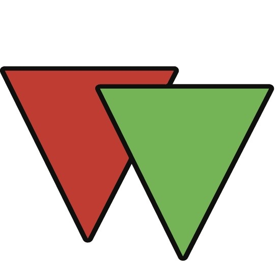

<!DOCTYPE html>
<html lang="id">
<head>
    <meta charset="UTF-8">
    <meta name="viewport" content="width=device-width, initial-scale=1.0, maximum-scale=1.0, user-scalable=no">
    <title>Digital Business Card - Syadad Nabil Mudzafar</title>
    <!-- Tailwind CSS -->
    
    <!-- Google Fonts: Inter & Plus Jakarta Sans -->
    <link href="https://fonts.googleapis.com/css2?family=Inter:wght@300;400;500;600;700&family=Plus+Jakarta+Sans:wght@400;600;700;800&display=swap" rel="stylesheet">
    <!-- FontAwesome Icons -->
    <link rel="stylesheet" href="https://cdnjs.cloudflare.com/ajax/libs/font-awesome/6.4.0/css/all.min.css">
    
    

    
</head>
<body class="text-white min-h-screen flex items-center justify-center p-4 md:p-8">

    <!-- Ambient Liquid Lighting -->
    

        

        

        

    

    <!-- Main Container -->
    

        
        <!-- Header / Brand Logo -->
        

            
                <i class="fa-solid fa-id-card-clip text-[10px]"></i> Kartu Profil Digital
            
        

        <!-- 3D Flippable Card Section (Locked Position) -->
        

            

                
                <!-- KARTU SISI DEPAN -->
                

                    

                    
                    <!-- Top Ribbon -->
                    

                        <!-- Corporate Logo (img1.jpg dengan fallback cerdas) -->
                        

                            

                                
                            

                            

                                
MEMBER OF

                                <h4 class="text-xs font-bold text-white tracking-wide leading-tight">PT. RIFAN FINANCINDO</h4>
                            

                        

                        
                        <!-- Verified Badge -->
                        
                             TERVERIFIKASI
                        
                    

                    <!-- Name & Title -->
                    

                        <h1 class="text-2xl font-bold tracking-tight font-jakarta bg-gradient-to-r from-white via-slate-100 to-slate-400 bg-clip-text text-transparent">
                            Syadad Nabil Mudzafar
                        </h1>
                        

                            Bisnis Konsultan
                        

                    

                    <!-- Bottom Branding & Slogan -->
                    

                        

                            
SLOGAN PERUSAHAAN

                            
"Strive for solid future."

                        

                        <!-- Flip Button Indicator -->
                        

                            <i class="fa-solid fa-rotate text-xs text-blue-300"></i>
                        

                    

                

                <!-- KARTU SISI BELAKANG -->
                

                    

                    <!-- Header Back -->
                    

                        
                            <i class="fa-solid fa-building text-blue-400"></i> Kantor Utama
                        
                        RFB JAKARTA
                    

                    <!-- Alamat Content -->
                    

                        
AXA Tower Lt. 25

                        

                            Jl. Prof. DR. Satrio Kav. 18, Lantai 30, 35, 23 & 25, Kuningan, Setiabudi, Jakarta Selatan, DKI Jakarta 12940
                        

                        

                            <i class="fa-solid fa-network-wired"></i> Multi-lantai Operasional: 23, 25, 30, & 35
                        

                    

                    <!-- Action Back -->
                    

                        <button id="copyAddressBtn" class="text-[11px] text-blue-300 hover:text-white flex items-center gap-1.5 transition-colors duration-200 bg-white/5 hover:bg-blue-500/20 px-2.5 py-1.5 rounded-lg border border-white/10">
                            <i class="fa-regular fa-copy" id="copyIcon"></i> Salin Alamat
                        </button>
                        

                            <i class="fa-solid fa-rotate text-xs text-blue-300"></i>
                        

                    

                

            

        

        <!-- Tap Hint -->
        

            <i class="fa-solid fa-hand-pointer mr-1"></i> Ketuk kartu untuk melihat alamat kantor
        

        <!-- Social & Chat Buttons Grid -->
        

            <h3 class="text-xs font-bold uppercase tracking-widest text-slate-400 text-left pl-1">Saluran Komunikasi Utama</h3>

            <!-- WhatsApp 1 -->
            <a href="https://wa.me/6285780085291?text=Halo%20Syadad%20Nabil%2C%20saya%20ingin%20berkonsultasi%20mengenai%20bisnis." 
               target="_blank" 
               class="glass-btn w-full px-5 py-4 rounded-xl flex items-center justify-between group">
                

                    

                        <i class="fa-brands fa-whatsapp text-xl"></i>
                    

                    

                        
WhatsApp Chat 1

                        
0857-8008-5291

                    

                

                

                    <i class="fa-solid fa-chevron-right text-xs"></i>
                

            </a>

            <!-- WhatsApp 2 -->
            <a href="https://wa.me/6285780085292?text=Halo%20Syadad%20Nabil%2C%20saya%20ingin%20berkonsultasi." 
               target="_blank" 
               class="glass-btn w-full px-5 py-4 rounded-xl flex items-center justify-between group">
                

                    

                        <i class="fa-brands fa-whatsapp text-xl"></i>
                    

                    

                        
WhatsApp Chat 2

                        
0857-8008-5292

                    

                

                

                    <i class="fa-solid fa-chevron-right text-xs"></i>
                

            </a>

            <!-- Telegram -->
            <a href="https://t.me/gus_adad" 
               target="_blank" 
               class="glass-btn w-full px-5 py-4 rounded-xl flex items-center justify-between group">
                

                    

                        <i class="fa-brands fa-telegram text-xl"></i>
                    

                    

                        
Telegram Messenger

                        
@gus_adad

                    

                

                

                    <i class="fa-solid fa-chevron-right text-xs"></i>
                

            </a>

            <!-- Social Media Section -->
            <h3 class="text-xs font-bold uppercase tracking-widest text-slate-400 text-left pl-1 pt-3">Media Sosial & Portofolio</h3>

            <!-- Grid for Instagram & X -->
            

                <!-- Instagram -->
                <a href="https://www.instagram.com/gus_adad?igsh=MTRkajNvNmJvaGF6bw%3D%3D&utm_source=qr" 
                   target="_blank" 
                   class="glass-btn px-4 py-4 rounded-xl flex flex-col justify-between items-start group relative">
                    

                        <i class="fa-brands fa-instagram text-lg"></i>
                    

                    

                        
Instagram

                        
@gus_adad

                    

                    

                        <i class="fa-solid fa-arrow-right text-[10px]"></i>
                    

                </a>

                <!-- X (Twitter) -->
                <a href="https://x.com/gus_adadd?s=21" 
                   target="_blank" 
                   class="glass-btn px-4 py-4 rounded-xl flex flex-col justify-between items-start group relative">
                    

                        <i class="fa-brands fa-x-twitter text-lg"></i>
                    

                    

                        
X Platform

                        
@gus_adadd

                    

                    

                        <i class="fa-solid fa-arrow-right text-[10px]"></i>
                    

                </a>
            

        

        <!-- Toast Notification Box -->
        

            <i class="fa-regular fa-circle-check text-sm"></i>
            Alamat berhasil disalin ke papan klip!
        

        <!-- Footer -->
        

            
© 2026 PT. Rifan Financindo Berjangka

            
Designed with Apple Liquid Glass Style

        

    

    <!-- Interactive Script logic -->
    
</body>
</html>

